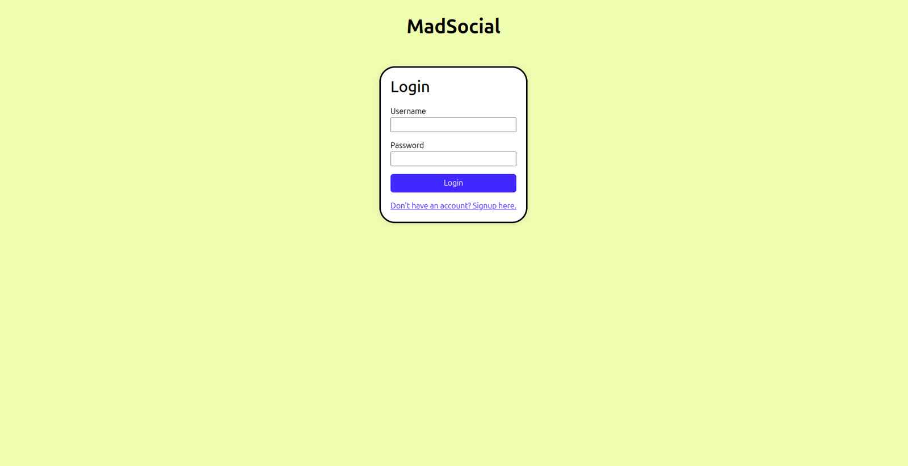

# MadSocial

This is social media application built using django, html and bootstrap

## Stories
- user can login and register, update their data 
- user can create,read,update,delete posts
- user cannot update or delete the post of another user 

## Screenshots

Here's how the project looks:





## How to Use

Clone the repository:

```bash
git clone https://github.com/yourusername/google-search-clone.git
```
