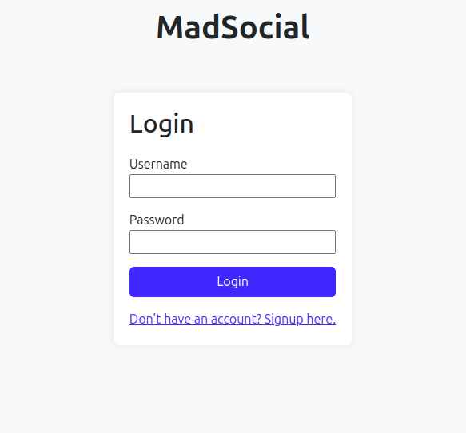

# MadSocial

This is social media application built using django and html ,bootstrap

## Features
- user can login and register
- user can create,read,update,delete posts

## Screenshots


Here's how the project looks:




## How to Use

Clone the repository:

```bash
git clone https://github.com/yourusername/google-search-clone.git
